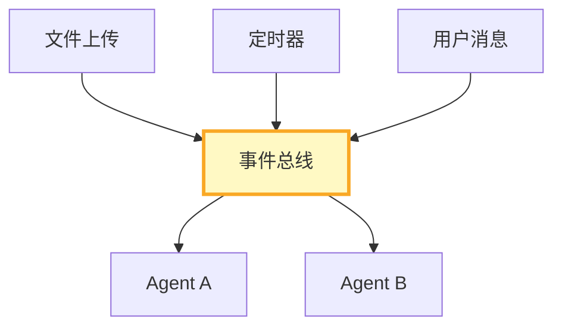

# 事件驱动架构图解

> 用图解理解事件总线、发布订阅和定时事件。

---

## 一、事件驱动 vs 请求-响应

```mermaid
graph TB
    subgraph 传统 {"请求-响应"}
        U1["用户→Agent→返回"]
    end
    subgraph 事件 {"事件驱动"}
        E1["多种事件源→Agent→主动推送"]

    style 传统 fill:#FFCDD2
    style 事件 fill:#C8E6C9
```

---

## 二、事件总线



---

## 三、检查清单

| 检查项 | 状态 |
|--------|------|
| 有事件总线 | ☐ |
| 有发布订阅 | ☐ |
| 有定时事件 | ☐ |
