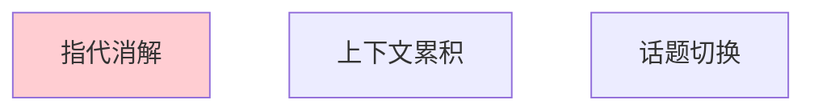
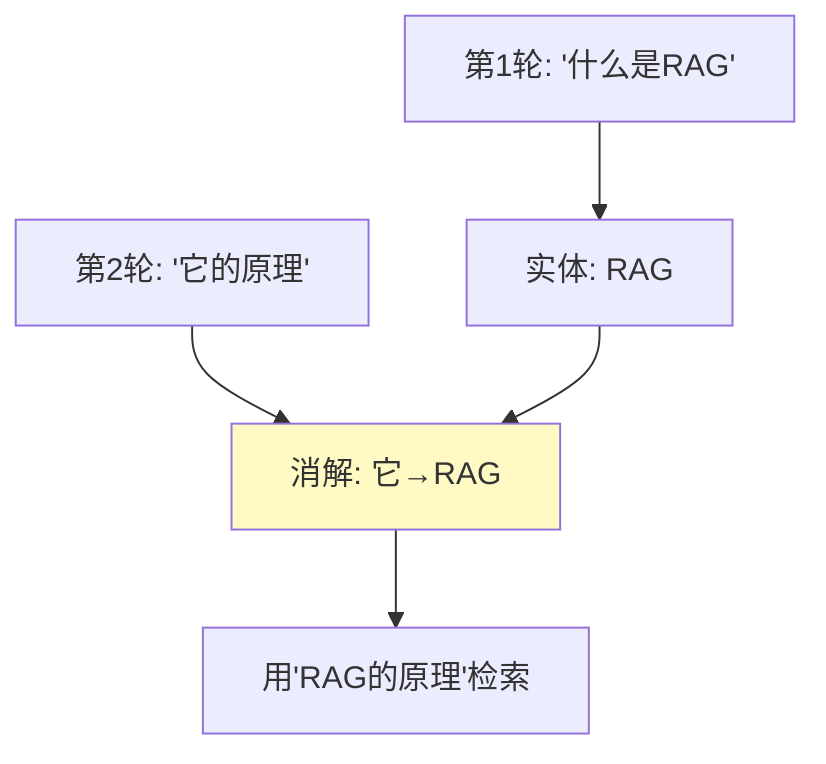
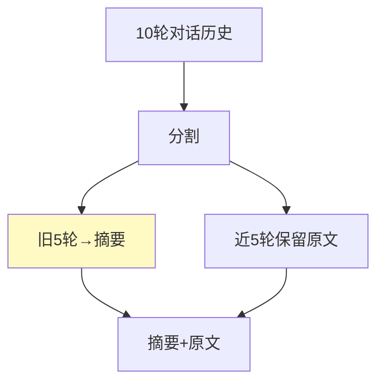

# RAG 多轮对话图解

> 用图解理解指代消解、上下文压缩和话题切换。

---

## 一、多轮对话挑战

```mermaid
graph TB
    C1["指代消解"]
    C2["上下文累积"]
    C3["话题切换"]

    style C1 fill:#FFCDD2
```

---

## 二、指代消解

```mermaid
graph TB
    T1["第1轮: '什么是RAG'"] --> ENTITY["实体: RAG"]
    T2["第2轮: '它的原理'"] --> RESOLVE["消解: 它→RAG"]
    ENTITY --> RESOLVE
    RESOLVE --> SEARCH["用'RAG的原理'检索"]

    style RESOLVE fill:#FFF9C4
```

---

## 三、上下文压缩

```mermaid
graph TB
    HIST["10轮对话历史"] --> SPLIT["分割"]
    SPLIT --> OLD["旧5轮→摘要"]
    SPLIT --> RECENT["近5轮保留原文"]
    OLD & RECENT --> MERGE["摘要+原文"]

    style OLD fill:#FFF9C4
```

---

## 四、检查清单

| 检查项 | 状态 |
|--------|------|
| 有指代消解 | ☐ |
| 有历史压缩 | ☐ |
| 有话题检测 | ☐ |
