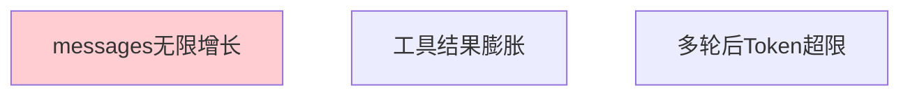
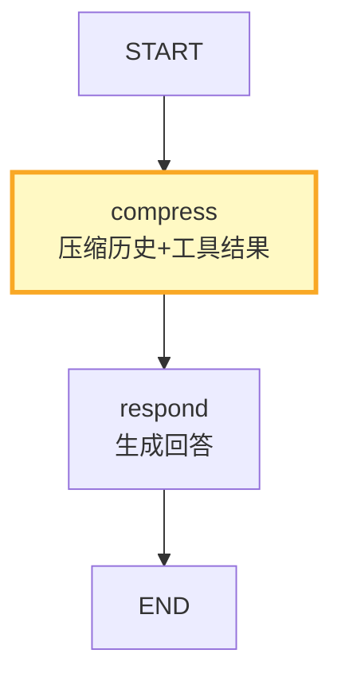
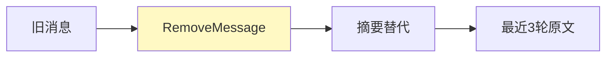

# 上下文窗口管理图解

> 用图解理解 LangGraph 中 messages 字段管理和 Token 预算控制。

---

## 一、上下文问题

---

## 二、压缩流程

---

## 三、RemoveMessage

---

## 四、检查清单

| 检查项 | 状态 |
|--------|------|
| 有历史压缩节点 | ☐ |
| 有工具结果压缩 | ☐ |
| 有Token预算检查 | ☐ |
