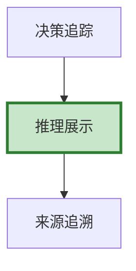
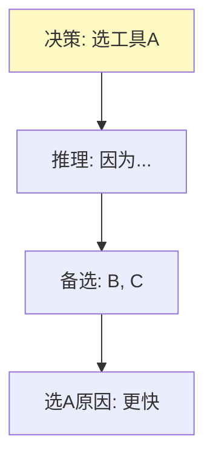

# 决策可解释性图解

> 用图解理解决策追踪、推理展示和来源追溯。

---

## 一、可解释性三层

```mermaid
graph TB
    L1["决策追踪"] --> L2["推理展示"]
    L2 --> L3["来源追溯"]

    style L2 fill:#C8E6C9,stroke:#2E7D32,stroke-width:3px
```

---

## 二、决策记录

```mermaid
graph TB
    DECISION["决策: 选工具A"] --> REASON["推理: 因为..."]
    REASON --> ALT["备选: B, C"]
    ALT --> SELECTED["选A原因: 更快"]

    style DECISION fill:#FFF9C4
```

---

## 三、检查清单

| 检查项 | 状态 |
|--------|------|
| 有决策追踪器 | ☐ |
| 有推理展示 | ☐ |
| 有来源追溯 | ☐ |
