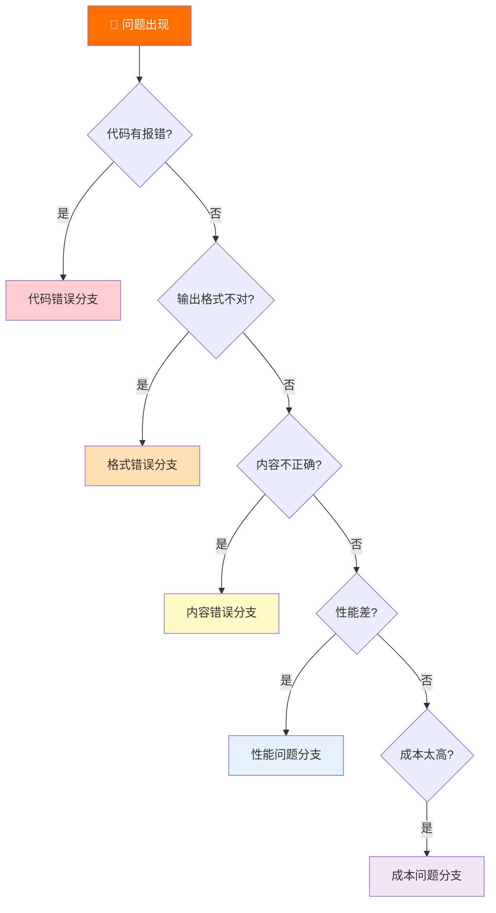
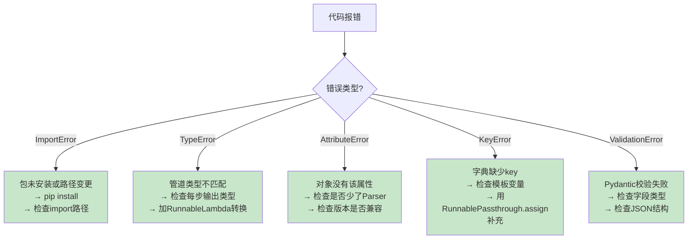
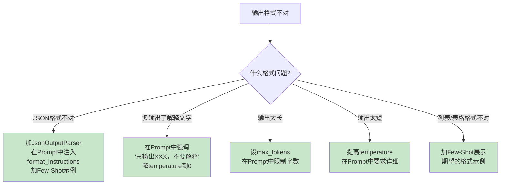
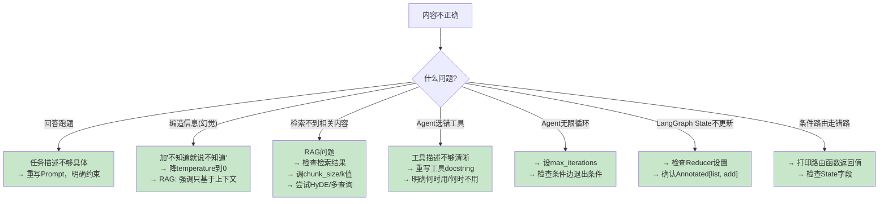
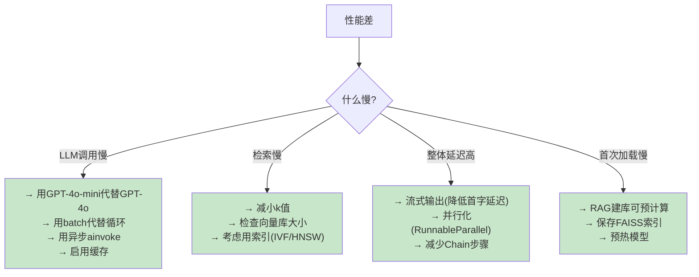
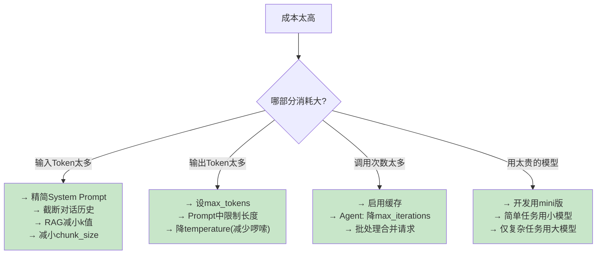
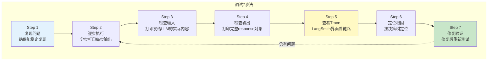
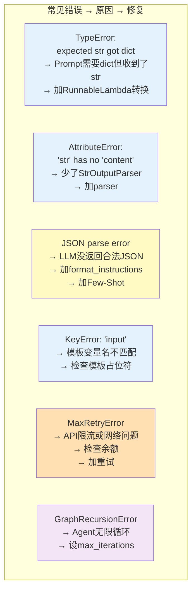

# 调试决策树图解

> 遇到问题时，按这个决策树一步步定位根因。

---

## 一、调试总决策树

```mermaid
graph TD
    START["🚨 问题出现"] --> Q1{"代码有报错?"}

    Q1 -->|"是"| CODE_ERR["代码错误分支"]
    Q1 -->|"否"| Q2{"输出格式不对?"}

    Q2 -->|"是"| FMT_ERR["格式错误分支"]
    Q2 -->|"否"| Q3{"内容不正确?"}

    Q3 -->|"是"| CONTENT_ERR["内容错误分支"]
    Q3 -->|"否"| Q4{"性能差?"}

    Q4 -->|"是"| PERF_ERR["性能问题分支"]
    Q4 -->|"否"| Q5{"成本太高?"}

    Q5 -->|"是"| COST_ERR["成本问题分支"]

    style START fill:#FF6F00,color:#fff
    style CODE_ERR fill:#FFCDD2
    style FMT_ERR fill:#FFE0B2
    style CONTENT_ERR fill:#FFF9C4
    style PERF_ERR fill:#E3F2FD
    style COST_ERR fill:#F3E5F5
```

## 二、代码错误分支

```mermaid
graph TD
    CODE_ERR["代码报错"] --> CE1{"错误类型?"}

    CE1 -->|"ImportError"| CE1A["包未安装或路径变更<br/>→ pip install<br/>→ 检查import路径"]
    CE1 -->|"TypeError"| CE1B["管道类型不匹配<br/>→ 检查每步输出类型<br/>→ 加RunnableLambda转换"]
    CE1 -->|"AttributeError"| CE1C["对象没有该属性<br/>→ 检查是否少了Parser<br/>→ 检查版本是否兼容"]
    CE1 -->|"KeyError"| CE1D["字典缺少key<br/>→ 检查模板变量<br/>→ 用RunnablePassthrough.assign补充"]
    CE1 -->|"ValidationError"| CE1E["Pydantic校验失败<br/>→ 检查字段类型<br/>→ 检查JSON结构"]

    style CE1A fill:#C8E6C9
    style CE1B fill:#C8E6C9
    style CE1C fill:#C8E6C9
    style CE1D fill:#C8E6C9
    style CE1E fill:#C8E6C9
```

## 三、格式错误分支

```mermaid
graph TD
    FMT_ERR["输出格式不对"] --> FE1{"什么格式问题?"}

    FE1 -->|"JSON格式不对"| FE1A["加JsonOutputParser<br/>在Prompt中注入format_instructions<br/>加Few-Shot示例"]
    FE1 -->|"多输出了解释文字"| FE1B["在Prompt中强调<br/>'只输出XXX，不要解释'<br/>降temperature到0"]
    FE1 -->|"输出太长"| FE1C["设max_tokens<br/>在Prompt中限制字数"]
    FE1 -->|"输出太短"| FE1D["提高temperature<br/>在Prompt中要求详细"]
    FE1 -->|"列表/表格格式不对"| FE1E["加Few-Shot展示<br/>期望的格式示例"]

    style FE1A fill:#C8E6C9
    style FE1B fill:#C8E6C9
    style FE1C fill:#C8E6C9
    style FE1D fill:#C8E6C9
    style FE1E fill:#C8E6C9
```

## 四、内容错误分支

```mermaid
graph TD
    CONTENT_ERR["内容不正确"] --> CERR1{"什么问题?"}

    CERR1 -->|"回答跑题"| CO1["任务描述不够具体<br/>→ 重写Prompt，明确约束"]
    CERR1 -->|"编造信息(幻觉)"| CO2["加'不知道就说不知道'<br/>→ 降temperature到0<br/>→ RAG: 强调只基于上下文"]
    CERR1 -->|"检索不到相关内容"| CO3["RAG问题<br/>→ 检查检索结果<br/>→ 调chunk_size/k值<br/>→ 尝试HyDE/多查询"]
    CERR1 -->|"Agent选错工具"| CO4["工具描述不够清晰<br/>→ 重写工具docstring<br/>→ 明确何时用/何时不用"]
    CERR1 -->|"Agent无限循环"| CO5["→ 设max_iterations<br/>→ 检查条件边退出条件"]
    CERR1 -->|"LangGraph State不更新"| CO6["→ 检查Reducer设置<br/>→ 确认Annotated[list, add]"]
    CERR1 -->|"条件路由走错路"| CO7["→ 打印路由函数返回值<br/>→ 检查State字段"]

    style CO1 fill:#C8E6C9
    style CO2 fill:#C8E6C9
    style CO3 fill:#C8E6C9
    style CO4 fill:#C8E6C9
    style CO5 fill:#C8E6C9
    style CO6 fill:#C8E6C9
    style CO7 fill:#C8E6C9
```

## 五、性能问题分支

```mermaid
graph TD
    PERF_ERR["性能差"] --> PE1{"什么慢?"}

    PE1 -->|"LLM调用慢"| PE1A["→ 用GPT-4o-mini代替GPT-4o<br/>→ 用batch代替循环<br/>→ 用异步ainvoke<br/>→ 启用缓存"]
    PE1 -->|"检索慢"| PE1B["→ 减小k值<br/>→ 检查向量库大小<br/>→ 考虑用索引(IVF/HNSW)"]
    PE1 -->|"整体延迟高"| PE1C["→ 流式输出(降低首字延迟)<br/>→ 并行化(RunnableParallel)<br/>→ 减少Chain步骤"]
    PE1 -->|"首次加载慢"| PE1D["→ RAG建库可预计算<br/>→ 保存FAISS索引<br/>→ 预热模型"]

    style PE1A fill:#C8E6C9
    style PE1B fill:#C8E6C9
    style PE1C fill:#C8E6C9
    style PE1D fill:#C8E6C9
```

## 六、成本问题分支

```mermaid
graph TD
    COST_ERR["成本太高"] --> COST1{"哪部分消耗大?"}

    COST1 -->|"输入Token太多"| CA1["→ 精简System Prompt<br/>→ 截断对话历史<br/>→ RAG减小k值<br/>→ 减小chunk_size"]
    COST1 -->|"输出Token太多"| CA2["→ 设max_tokens<br/>→ Prompt中限制长度<br/>→ 降temperature(减少啰嗦)"]
    COST1 -->|"调用次数太多"| CA3["→ 启用缓存<br/>→ Agent: 降max_iterations<br/>→ 批处理合并请求"]
    COST1 -->|"用太贵的模型"| CA4["→ 开发用mini版<br/>→ 简单任务用小模型<br/>→ 仅复杂任务用大模型"]

    style CA1 fill:#C8E6C9
    style CA2 fill:#C8E6C9
    style CA3 fill:#C8E6C9
    style CA4 fill:#C8E6C9
```

## 七、调试步骤可视化

```mermaid
graph TB
    subgraph 调试7步法 ["调试7步法"]
        S1["Step 1<br/>复现问题<br/>确保能稳定复现"]
        S2["Step 2<br/>逐步执行<br/>分步打印每步输出"]
        S3["Step 3<br/>检查输入<br/>打印发给LLM的实际内容"]
        S4["Step 4<br/>检查输出<br/>打印完整response对象"]
        S5["Step 5<br/>查看Trace<br/>LangSmith界面看链路"]
        S6["Step 6<br/>定位根因<br/>按决策树定位"]
        S7["Step 7<br/>修复验证<br/>修复后重新测试"]
    end

    S1 --> S2 --> S3 --> S4 --> S5 --> S6 --> S7
    S7 -.->|"仍有问题"| S2

    style S1 fill:#E3F2FD
    style S5 fill:#FFF9C4
    style S7 fill:#C8E6C9
```

## 八、常见错误对照表

```mermaid
graph TB
    subgraph 错误速查 ["常见错误 → 原因 → 修复"]
        E1["TypeError:<br/>expected str got dict<br/>→ Prompt需要dict但收到了str<br/>→ 加RunnableLambda转换"]
        E2["AttributeError:<br/>'str' has no 'content'<br/>→ 少了StrOutputParser<br/>→ 加parser"]
        E3["JSON parse error<br/>→ LLM没返回合法JSON<br/>→ 加format_instructions<br/>→ 加Few-Shot"]
        E4["KeyError: 'input'<br/>→ 模板变量名不匹配<br/>→ 检查模板占位符"]
        E5["MaxRetryError<br/>→ API限流或网络问题<br/>→ 检查余额<br/>→ 加重试"]
        E6["GraphRecursionError<br/>→ Agent无限循环<br/>→ 设max_iterations"]
    end

    style E1 fill:#E3F2FD
    style E2 fill:#E3F2FD
    style E3 fill:#FFF9C4
    style E4 fill:#E3F2FD
    style E5 fill:#FFE0B2
    style E6 fill:#F3E5F5
```
