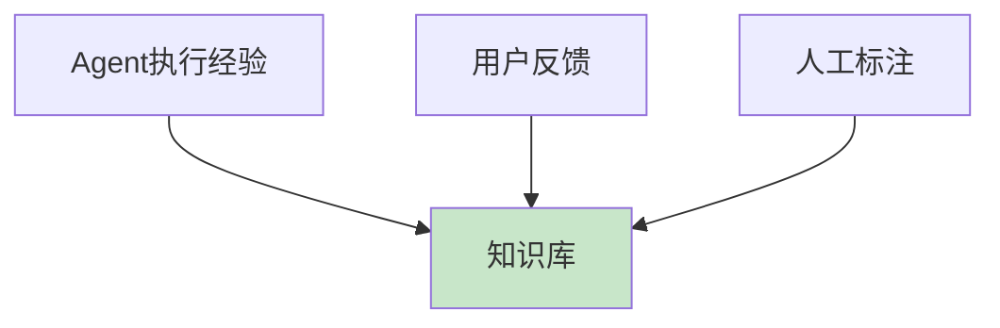
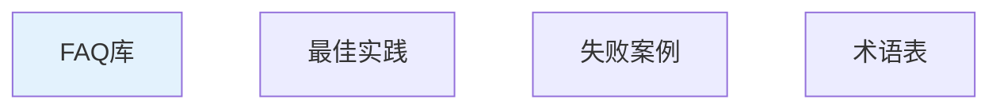

# 知识沉淀图解

> 用图解理解知识来源、沉淀形式和自动提取。

---

## 一、知识来源

```mermaid
graph TB
    S1["Agent执行经验"] --> KB["知识库"]
    S2["用户反馈"] --> KB
    S3["人工标注"] --> KB

    style KB fill:#C8E6C9
```

---

## 二、沉淀形式

```mermaid
graph TB
    F1["FAQ库"]
    F2["最佳实践"]
    F3["失败案例"]
    F4["术语表"]

    style F1 fill:#E3F2FD
```

---

## 三、检查清单

| 检查项 | 状态 |
|--------|------|
| 有知识库 | ☐ |
| 有自动提取 | ☐ |
| 有使用统计 | ☐ |
