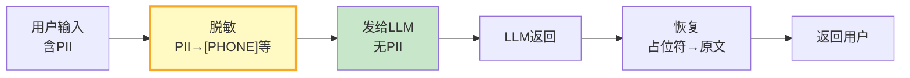
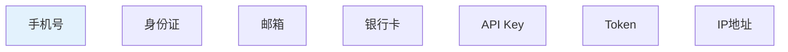

# 数据脱敏图解

> 用图解理解 PII 检测、脱敏和恢复流程。

---

## 一、脱敏流程

```mermaid
graph LR
    INPUT["用户输入<br/>含PII"] --> MASK["脱敏<br/>PII→[PHONE]等"]
    MASK --> SEND["发给LLM<br/>无PII"]
    SEND --> RESP["LLM返回"]
    RESP --> UNMASK["恢复<br/>占位符→原文"]
    UNMASK --> OUT["返回用户"]

    style MASK fill:#FFF9C4,stroke:#F9A825,stroke-width:3px
    style SEND fill:#C8E6C9
```

---

## 二、7种PII

```mermaid
graph TB
    P1["手机号"]
    P2["身份证"]
    P3["邮箱"]
    P4["银行卡"]
    P5["API Key"]
    P6["Token"]
    P7["IP地址"]

    style P1 fill:#E3F2FD
```

---

## 三、检查清单

| 检查项 | 状态 |
|--------|------|
| 有PII脱敏器 | ☐ |
| 有7种PII模式 | ☐ |
| 有安全LLM包装 | ☐ |
