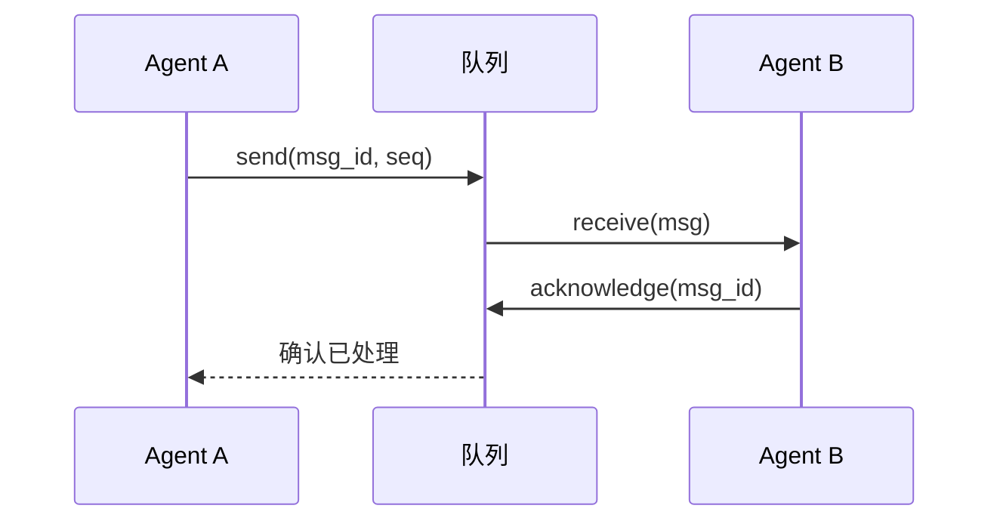

# 消息可靠性图解

> 用图解理解消息不丢、不重、不乱序。

---

## 一、三保证

```mermaid
graph TB
    A1["不丢: 至少一次投递"]
    A2["不重: 幂等处理"]
    A3["不乱序: 序列号"]

    style A1 fill:#C8E6C9,stroke:#2E7D32,stroke-width:3px
```

---

## 二、消息流程

```mermaid
sequenceDiagram
    participant A as Agent A
    participant Q as 队列
    participant B as Agent B
    A->>Q: send(msg_id, seq)
    Q->>B: receive(msg)
    B->>Q: acknowledge(msg_id)
    Q-->>A: 确认已处理
```

---

## 三、检查清单

| 检查项 | 状态 |
|--------|------|
| 有消息队列 | ☐ |
| 有ACK确认 | ☐ |
| 有重试机制 | ☐ |
