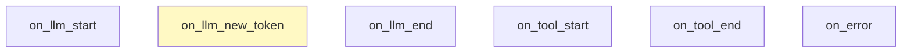
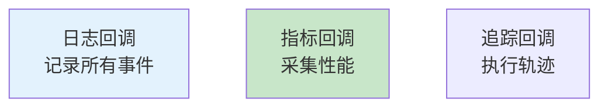

# 回调系统图解

> 用图解理解回调事件和三种回调处理器。

---

## 一、回调事件

```mermaid
graph TB
    E1["on_llm_start"]
    E2["on_llm_new_token"]
    E3["on_llm_end"]
    E4["on_tool_start"]
    E5["on_tool_end"]
    E6["on_error"]

    style E2 fill:#FFF9C4
```

---

## 二、三种处理器

```mermaid
graph TB
    LOG["日志回调<br/>记录所有事件"]
    METRICS["指标回调<br/>采集性能"]
    TRACE["追踪回调<br/>执行轨迹"]

    style LOG fill:#E3F2FD
    style METRICS fill:#C8E6C9
```

---

## 三、检查清单

| 检查项 | 状态 |
|--------|------|
| 有日志回调 | ☐ |
| 有指标回调 | ☐ |
| 有追踪回调 | ☐ |
