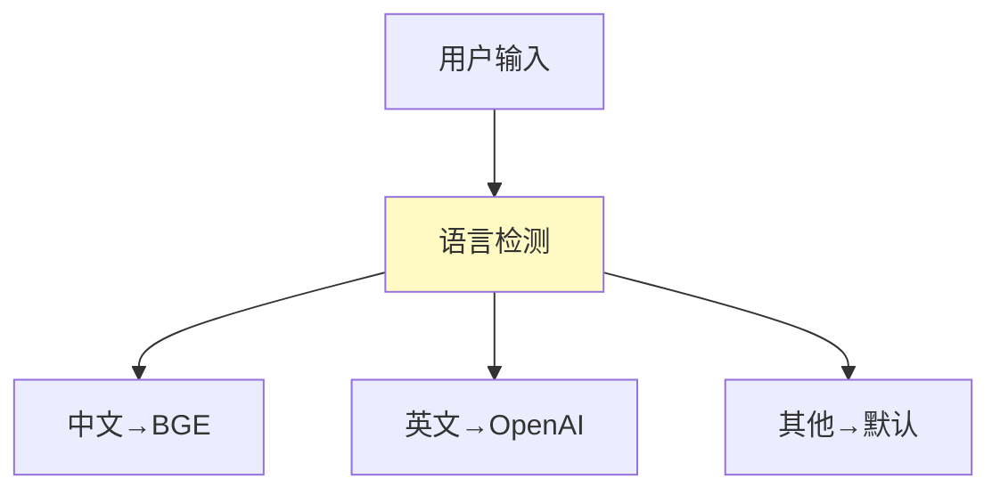
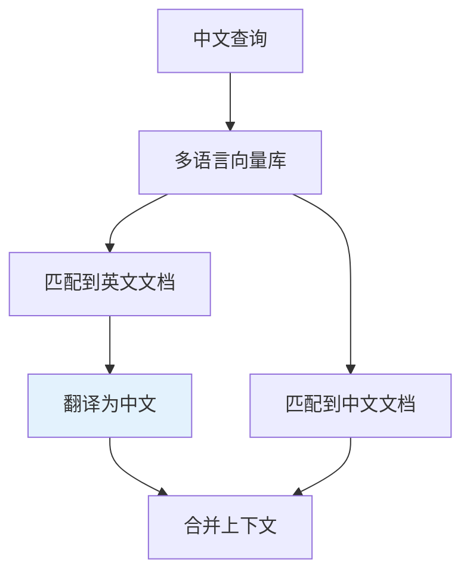

# 多语言处理图解

> 用图解理解语言检测和路由。

---

## 一、语言路由

```mermaid
graph TB
    INPUT["用户输入"] --> DETECT["语言检测"]
    DETECT --> ZH["中文→BGE"]
    DETECT --> EN["英文→OpenAI"]
    DETECT --> OTHER["其他→默认"]

    style DETECT fill:#FFF9C4
```

---

## 二、跨语言检索

```mermaid
graph TB
    Q["中文查询"] --> SEARCH["多语言向量库"]
    SEARCH --> EN_DOC["匹配到英文文档"]
    SEARCH --> ZH_DOC["匹配到中文文档"]
    EN_DOC --> TRANS["翻译为中文"]
    TRANS & ZH_DOC --> MERGE["合并上下文"]

    style TRANS fill:#E3F2FD
```

---

## 三、检查清单

| 检查项 | 状态 |
|--------|------|
| 有语言检测 | ☐ |
| 有多语言配置 | ☐ |
