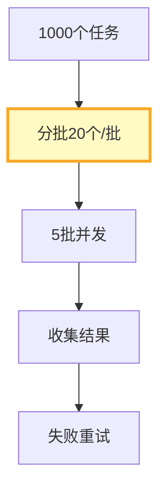
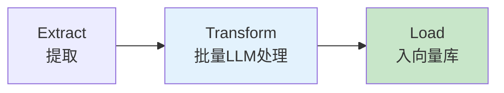

# 批量处理 ETL 图解

> 用图解理解批量处理流程和ETL管线。

---

## 一、批量流程

```mermaid
graph TB
    QUEUE["1000个任务"] --> BATCH["分批20个/批"]
    BATCH --> CONCURRENT["5批并发"]
    CONCURRENT --> COLLECT["收集结果"]
    COLLECT --> RETRY["失败重试"]

    style BATCH fill:#FFF9C4,stroke:#F9A825,stroke-width:3px
```

---

## 二、ETL管线

```mermaid
graph LR
    E["Extract<br/>提取"] --> T["Transform<br/>批量LLM处理"]
    T --> L["Load<br/>入向量库"]

    style T fill:#E3F2FD
    style L fill:#C8E6C9
```

---

## 三、检查清单

| 检查项 | 状态 |
|--------|------|
| 有批量处理器 | ☐ |
| 有并发控制 | ☐ |
| 有ETL管线 | ☐ |
