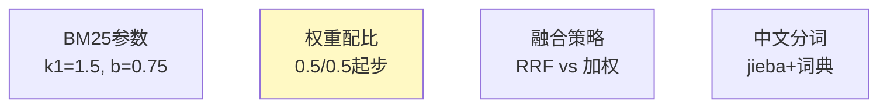
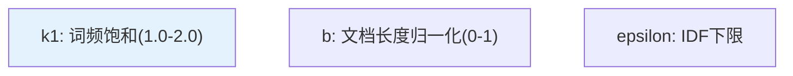

# RAG 混合检索调优图解

> 用图解理解 BM25 参数、权重配比和中文分词优化。

---

## 一、调优维度

```mermaid
graph TB
    D1["BM25参数<br/>k1=1.5, b=0.75"]
    D2["权重配比<br/>0.5/0.5起步"]
    D3["融合策略<br/>RRF vs 加权"]
    D4["中文分词<br/>jieba+词典"]

    style D2 fill:#FFF9C4
```

---

## 二、BM25参数

```mermaid
graph TB
    K1["k1: 词频饱和(1.0-2.0)"]
    B["b: 文档长度归一化(0-1)"]
    EPS["epsilon: IDF下限"]

    style K1 fill:#E3F2FD
```

---

## 三、检查清单

| 检查项 | 状态 |
|--------|------|
| 有可调BM25 | ☐ |
| 有网格搜索 | ☐ |
| 有中文分词 | ☐ |
