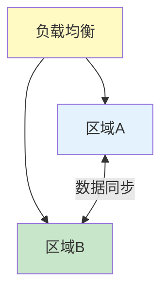
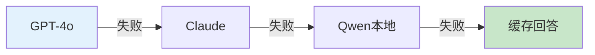

# 容灾高可用图解

> 用图解理解多活架构、故障转移和降级链。

---

## 一、多活架构

```mermaid
graph TB
    LB["负载均衡"] --> R1["区域A"]
    LB --> R2["区域B"]
    R1 <-->|"数据同步"| R2

    style LB fill:#FFF9C4
    style R1 fill:#E3F2FD
    style R2 fill:#C8E6C9
```

---

## 二、LLM降级链

```mermaid
graph LR
    L1["GPT-4o"] -->|失败| L2["Claude"]
    L2 -->|失败| L3["Qwen本地"]
    L3 -->|失败| L4["缓存回答"]

    style L1 fill:#E3F2FD
    style L4 fill:#C8E6C9
```

---

## 三、检查清单

| 检查项 | 状态 |
|--------|------|
| 有故障转移 | ☐ |
| 有LLM降级链 | ☐ |
| 有健康检查 | ☐ |
