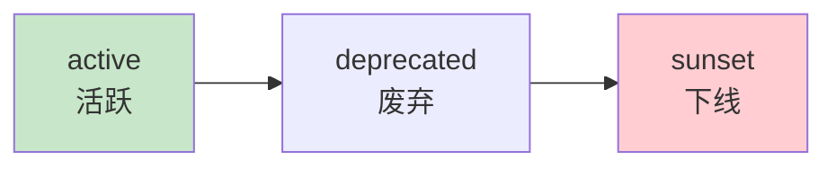
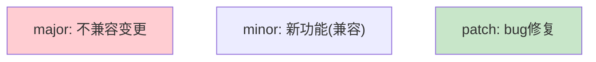

# 工具版本管理图解

> 用图解理解语义版本号和兼容性检查。

---

## 一、版本状态

```mermaid
graph LR
    ACTIVE["active<br/>活跃"] --> DEPRECATED["deprecated<br/>废弃"]
    DEPRECATED --> SUNSET["sunset<br/>下线"]

    style ACTIVE fill:#C8E6C9
    style SUNSET fill:#FFCDD2
```

---

## 二、语义版本

```mermaid
graph TB
    MAJOR["major: 不兼容变更"]
    MINOR["minor: 新功能(兼容)"]
    PATCH["patch: bug修复"]

    style MAJOR fill:#FFCDD2
    style PATCH fill:#C8E6C9
```

---

## 三、检查清单

| 检查项 | 状态 |
|--------|------|
| 有版本注册表 | ☐ |
| 有兼容检查 | ☐ |
| 有废弃流程 | ☐ |
