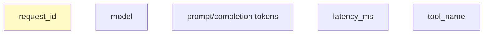

# 日志规范图解

> 用图解理解日志分级和结构化记录。

---

## 一、5级日志

```mermaid
graph TB
    DEBUG["DEBUG: 调试"]
    INFO["INFO: 正常"]
    WARN["WARN: 警告"]
    ERROR["ERROR: 错误"]
    AUDIT["AUDIT: 审计"]

    style AUDIT fill:#C8E6C9,stroke:#2E7D32,stroke-width:3px
```

---

## 二、结构化字段

```mermaid
graph TB
    REQ["request_id"]
    MODEL["model"]
    TOKENS["prompt/completion tokens"]
    LATENCY["latency_ms"]
    TOOL["tool_name"]

    style REQ fill:#FFF9C4
```

---

## 三、检查清单

| 检查项 | 状态 |
|--------|------|
| 有结构化日志 | ☐ |
| 有5级分类 | ☐ |
| 有脱敏处理 | ☐ |
