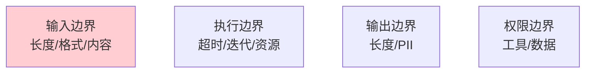
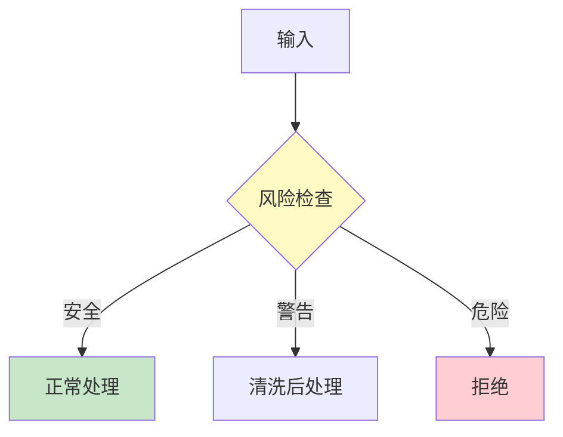

# Agent 边界防护图解

> 用图解理解输入边界、执行边界和优雅降级。

---

## 一、4类边界

```mermaid
graph TB
    B1["输入边界<br/>长度/格式/内容"]
    B2["执行边界<br/>超时/迭代/资源"]
    B3["输出边界<br/>长度/PII"]
    B4["权限边界<br/>工具/数据"]

    style B1 fill:#FFCDD2
```

---

## 二、降级流程

```mermaid
graph TB
    INPUT["输入"] --> CHECK{"风险检查"}
    CHECK -->|安全| PROCESS["正常处理"]
    CHECK -->|警告| CLEAN["清洗后处理"]
    CHECK -->|危险| REJECT["拒绝"]

    style CHECK fill:#FFF9C4
    style REJECT fill:#FFCDD2
    style PROCESS fill:#C8E6C9
```

---

## 三、检查清单

| 检查项 | 状态 |
|--------|------|
| 有输入边界检查 | ☐ |
| 有执行边界控制 | ☐ |
| 有优雅降级 | ☐ |
