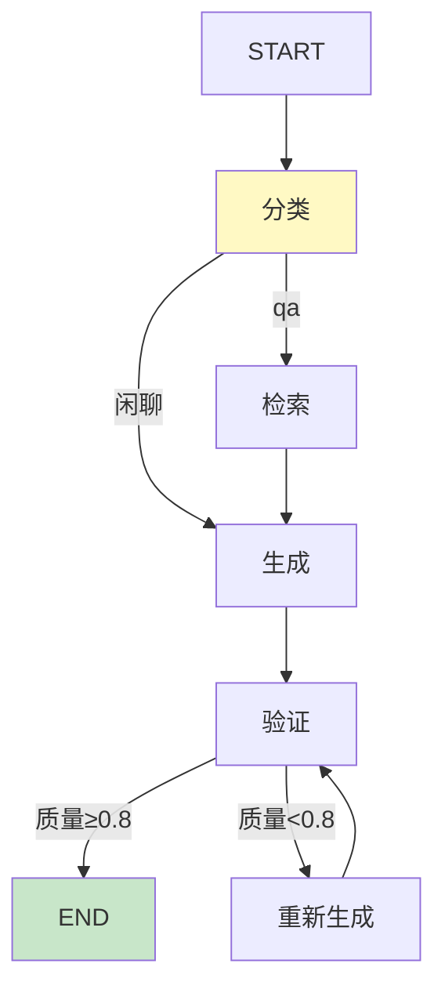

# 状态机设计图解

> 用图解理解 State 定义、复杂路由和持久化。

---

## 一、三要素

```mermaid
graph TB
    S1["State定义<br/>数据结构+Reducer"]
    S2["节点设计<br/>输入输出"]
    S3["路由设计<br/>条件边+循环"]

    style S1 fill:#C8E6C9,stroke:#2E7D32,stroke-width:3px
```

---

## 二、复杂路由

```mermaid
graph TB
    START --> CLASSIFY["分类"]
    CLASSIFY -->|qa| RETRIEVE["检索"]
    CLASSIFY -->|闲聊| GENERATE["生成"]
    RETRIEVE --> GENERATE
    GENERATE --> VERIFY["验证"]
    VERIFY -->|质量≥0.8| END
    VERIFY -->|质量<0.8| REGEN["重新生成"]
    REGEN --> VERIFY

    style CLASSIFY fill:#FFF9C4
    style END fill:#C8E6C9
```

---

## 三、检查清单

| 检查项 | 状态 |
|--------|------|
| 有高级State | ☐ |
| 有复杂路由 | ☐ |
| 有持久化 | ☐ |
