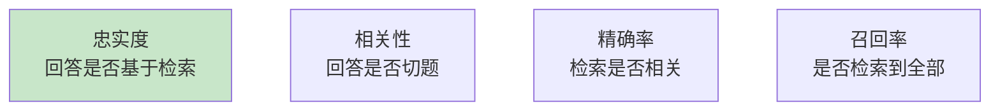
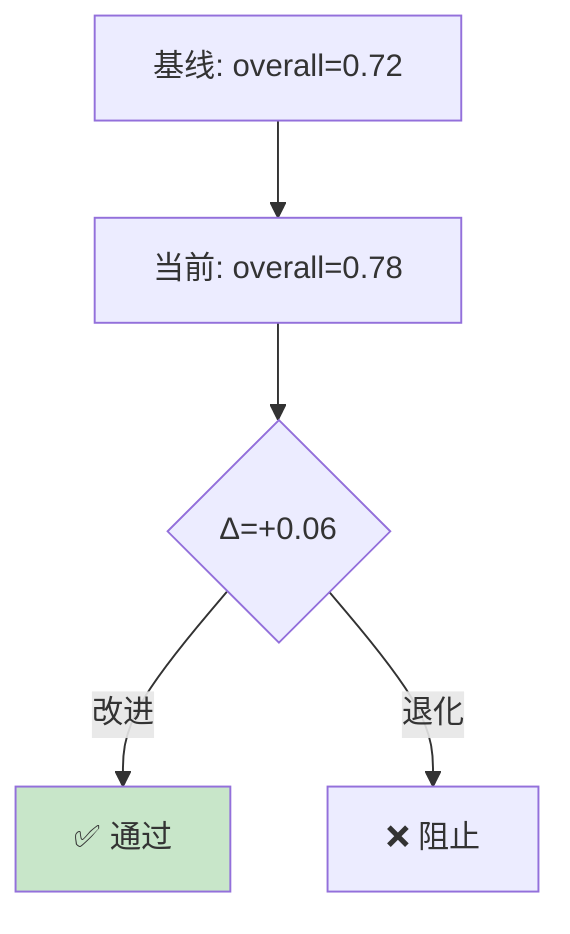

# RAG 评估指标图解

> 用图解理解四大指标和基线管理。

---

## 一、四大指标

```mermaid
graph TB
    M1["忠实度<br/>回答是否基于检索"]
    M2["相关性<br/>回答是否切题"]
    M3["精确率<br/>检索是否相关"]
    M4["召回率<br/>是否检索到全部"]

    style M1 fill:#C8E6C9
```

---

## 二、基线对比

```mermaid
graph TB
    BASE["基线: overall=0.72"] --> CURRENT["当前: overall=0.78"]
    CURRENT --> DELTA{"Δ=+0.06"}
    DELTA -->|改进| PASS["✅ 通过"]
    DELTA -->|退化| BLOCK["❌ 阻止"]

    style PASS fill:#C8E6C9
```

---

## 三、检查清单

| 检查项 | 状态 |
|--------|------|
| 有四大指标 | ☐ |
| 有批量评估 | ☐ |
| 有基线管理 | ☐ |
