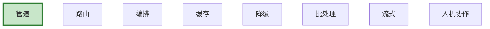
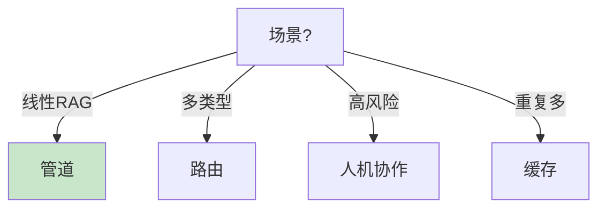

# 设计模式图解

> 用图解理解 8 种设计模式和选型决策。

---

## 一、8种模式

```mermaid
graph TB
    P1["管道"]
    P2["路由"]
    P3["编排"]
    P4["缓存"]
    P5["降级"]
    P6["批处理"]
    P7["流式"]
    P8["人机协作"]

    style P1 fill:#C8E6C9,stroke:#2E7D32,stroke-width:3px
```

---

## 二、选型

```mermaid
graph TB
    Q["场景?"] -->|线性RAG| PIPE["管道"]
    Q -->|多类型| ROUTE["路由"]
    Q -->|高风险| HUMAN["人机协作"]
    Q -->|重复多| CACHE["缓存"]

    style PIPE fill:#C8E6C9
```

---

## 三、检查清单

| 检查项 | 状态 |
|--------|------|
| 理解8种模式 | ☐ |
| 能选模式 | ☐ |
