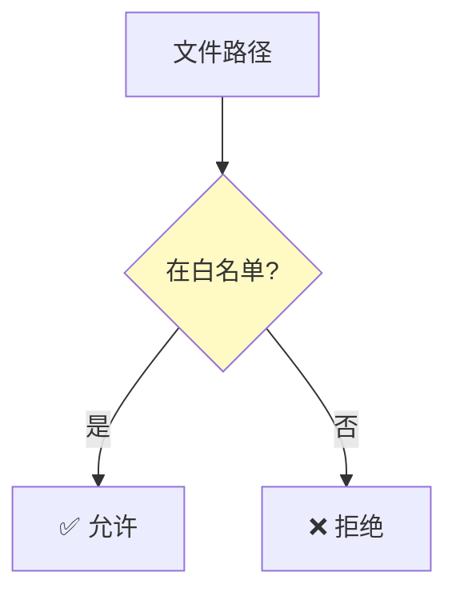

# 工具沙箱图解

> 用图解理解 4 层隔离。

---

## 一、4层隔离

```mermaid
graph TB
    L1["权限层: 工具级策略"]
    L2["文件层: 路径白名单"]
    L3["网络层: 域名白名单"]
    L4["进程层: 资源限制"]

    style L1 fill:#C8E6C9
```

---

## 二、文件隔离

```mermaid
graph TB
    PATH["文件路径"] --> CHECK{"在白名单?"}
    CHECK -->|是| ALLOW["✅ 允许"]
    CHECK -->|否| DENY["❌ 拒绝"]

    style CHECK fill:#FFF9C4
```

---

## 三、检查清单

| 检查项 | 状态 |
|--------|------|
| 有文件隔离 | ☐ |
| 有网络隔离 | ☐ |
| 有进程隔离 | ☐ |
