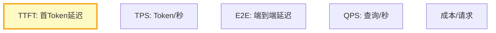
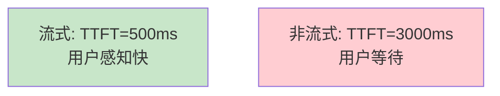

# 性能基准图解

> 用图解理解 LLM 性能指标和基准测试。

---

## 一、5指标

```mermaid
graph TB
    M1["TTFT: 首Token延迟"]
    M2["TPS: Token/秒"]
    M3["E2E: 端到端延迟"]
    M4["QPS: 查询/秒"]
    M5["成本/请求"]

    style M1 fill:#FFF9C4,stroke:#F9A825,stroke-width:3px
```

---

## 二、流式vs非流式

```mermaid
graph TB
    STREAM["流式: TTFT=500ms<br/>用户感知快"]
    SYNC["非流式: TTFT=3000ms<br/>用户等待"]

    style STREAM fill:#C8E6C9
    style SYNC fill:#FFCDD2
```

---

## 三、检查清单

| 检查项 | 状态 |
|--------|------|
| 有TTFT测量 | ☐ |
| 有P95统计 | ☐ |
| 有RAG基准 | ☐ |
