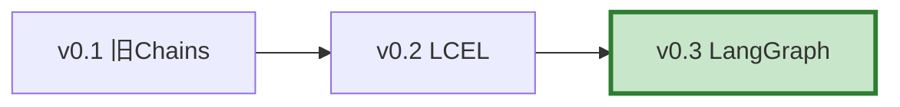
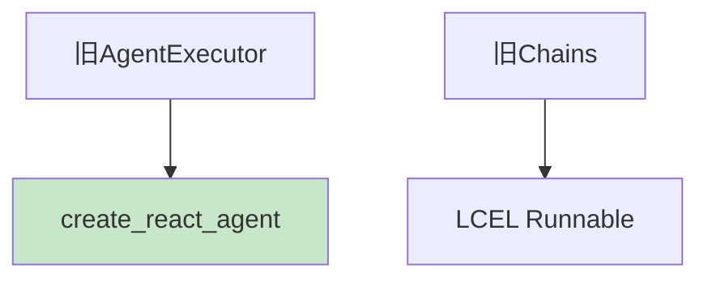

# 版本演进生态图解

> 用图解理解 LangChain 版本演进和迁移路径。

---

## 一、版本演进

```mermaid
graph LR
    V01["v0.1 旧Chains"] --> V02["v0.2 LCEL"]
    V02 --> V03["v0.3 LangGraph"]

    style V03 fill:#C8E6C9,stroke:#2E7D32,stroke-width:3px
```

---

## 二、迁移路径

```mermaid
graph TB
    OLD["旧AgentExecutor"] --> NEW["create_react_agent"]
    OLD_CHAIN["旧Chains"] --> LCEL["LCEL Runnable"]

    style NEW fill:#C8E6C9
```

---

## 三、检查清单

| 检查项 | 状态 |
|--------|------|
| 知道当前版本 | ☐ |
| 能迁移旧代码 | ☐ |
