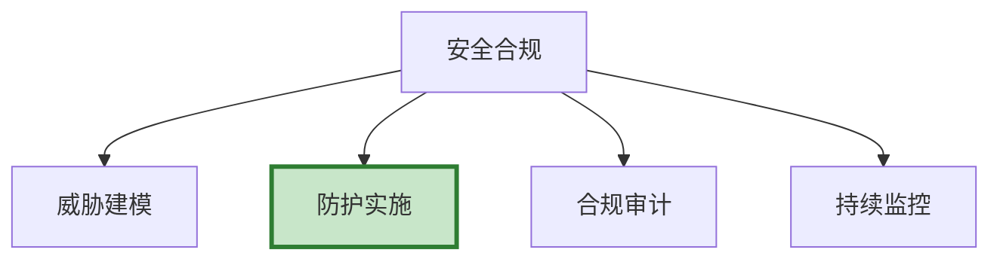
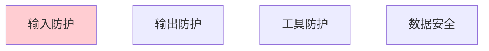

# 安全合规体系图解

> 用图解理解安全防护全链路和合规审计。

---

## 一、安全全景

```mermaid
graph TB
    ROOT["安全合规"] --> T["威胁建模"]
    ROOT --> P["防护实施"]
    ROOT --> A["合规审计"]
    ROOT --> M["持续监控"]

    style P fill:#C8E6C9,stroke:#2E7D32,stroke-width:3px
```

---

## 二、防护层级

```mermaid
graph TB
    L1["输入防护"]
    L2["输出防护"]
    L3["工具防护"]
    L4["数据安全"]

    style L1 fill:#FFCDD2
```

---

## 三、检查清单

| 检查项 | 状态 |
|--------|------|
| 有安全清单 | ☐ |
| 有合规审计 | ☐ |
