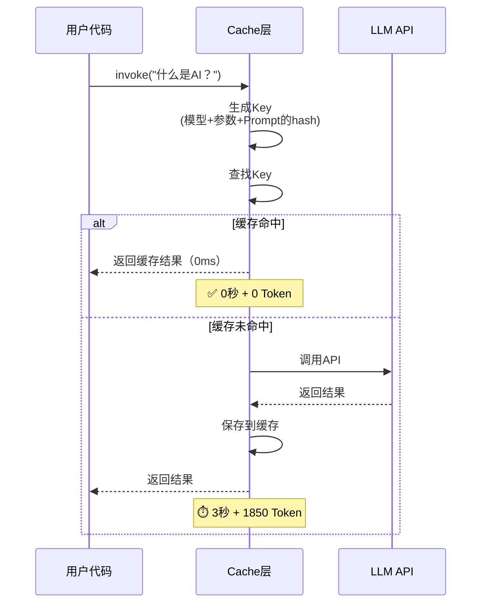
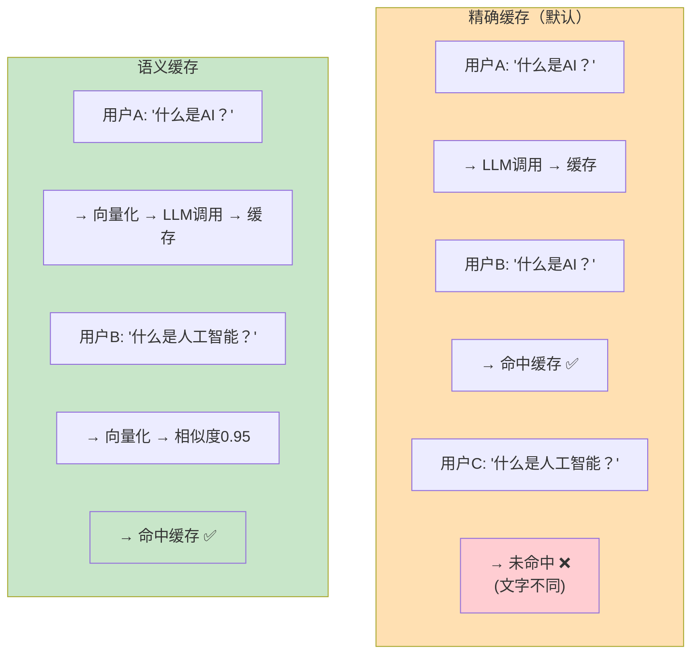
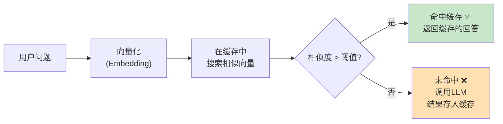
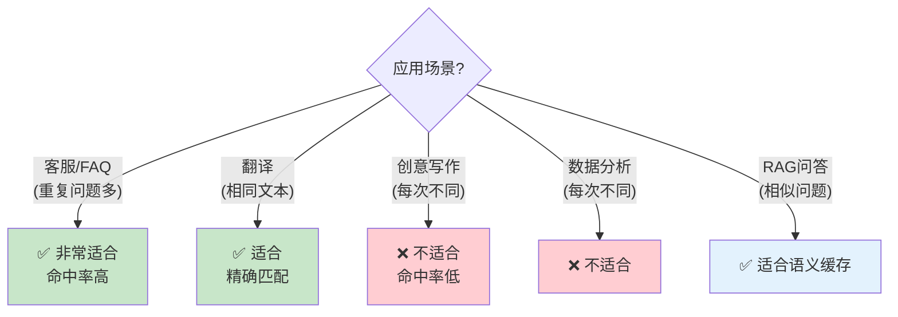

# 缓存策略图解

> 用图解理解 LLM 缓存的工作原理、语义缓存与精确缓存的区别、分层缓存架构。

---

## 一、缓存工作原理



## 二、精确缓存 vs 语义缓存



### 语义缓存的命中流程



## 三、分层缓存架构

```mermaid
graph TB
    subgraph 三层缓存 ["三层缓存架构"}
        L1["L1: 应用层缓存<br/>Python dict / lru_cache<br/>缓存问答对<br/>✅ 最快(0ms)<br/>❌ 重启丢失"]
        L2["L2: LLM缓存<br/>LangChain Cache<br/>缓存LLM调用结果<br/>✅ 持久化<br/>✅ 自动管理"]
        L3["L3: 检索缓存<br/>缓存向量检索结果<br/>相同查询不重复检索<br/>✅ 节省检索时间"]
    end

    REQ["请求"] --> L1
    L1 -->|"未命中"| L2
    L2 -->|"未命中"| L3
    L3 --> NEED_LLM["需要调用LLM"]
    L3 -->|"已有检索结果"| L2

    style L1 fill:#C8E6C9
    style L2 fill:#FFF9C4
    style L3 fill:#FFE0B2
```

## 四、缓存 Key 的生成

```mermaid
graph TB
    subgraph Key组成 ["缓存Key由以下要素组合哈希生成"}
        K1["模型名称<br/>gpt-4o-mini"]
        K2["Prompt完整内容<br/>System+Human消息"]
        K3["temperature<br/>0 vs 0.7"]
        K4["max_tokens<br/>1000 vs 2000"]
        K5["其他参数<br/>top_p等"]
    end

    K1 & K2 & K3 & K4 & K5 --> HASH["SHA256哈希<br/>→ 缓存Key"]

    HASH --> NOTE["任一要素变化<br/>→ Key不同 → 缓存未命中"]

    style HASH fill:#FFF9C4
    style NOTE fill:#FFE0B2
```

## 五、缓存对成本的影响

```mermaid
graph TB
    subgraph 无缓存 ["无缓存（1000次调用）"}
        NC1["每次都调用API<br/>1000 × 1850 tokens<br/>= 1,850,000 tokens"]
        NC2["成本: $1.11"]
    end

    subgraph 有缓存 ["有缓存（30%命中率）"}
        C1["70%调用API: 700次 × 1850 = 1,295,000 tokens"]
        C2["30%命中缓存: 300次 × 0 = 0 tokens"]
        C3["成本: $0.78"]
        C4["节省: 30%"]
    end

    subgraph 高命中 ["高命中率（70%）"}
        H1["30%调用API: 300次 × 1850 = 555,000 tokens"]
        H2["70%命中缓存: 700次 × 0 = 0 tokens"]
        H3["成本: $0.33"]
        H4["节省: 70%"]
    end

    style 无缓存 fill:#FFCDD2
    style 有缓存 fill:#FFF9C4
    style 高命中 fill:#C8E6C9
```

## 六、缓存适用性判断



## 七、缓存注意事项

```mermaid
graph TB
    subgraph 注意事项 ["缓存注意事项"}
        N1["⚠️ temperature影响<br/>temp=0: 缓存有意义<br/>temp>0: 输出不确定<br/>缓存只保存第一次的结果"]
        N2["⚠️ stream不检查缓存<br/>stream()不查缓存<br/>用invoke()才能命中"]
        N3["⚠️ 语义缓存误命中<br/>'Python好不好'<br/>和'Python不好'<br/>语义相似但意思相反"]
        N4["⚠️ 缓存过期<br/>知识库更新后<br/>旧缓存可能过时<br/>需要手动清除"]
    end

    style N1 fill:#FFE0B2
    style N2 fill:#FFCDD2
    style N3 fill:#FFCDD2
    style N4 fill:#FFF9C4
```
