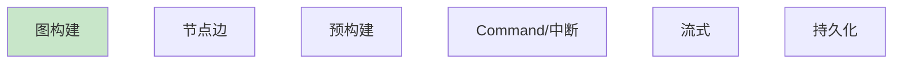
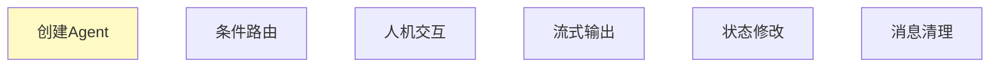

# LangGraph API 图解

> 用图解理解核心 API 和常用模式。

---

## 一、API分类

```mermaid
graph TB
    G["图构建"]
    N["节点边"]
    P["预构建"]
    C["Command/中断"]
    S["流式"]
    PS["持久化"]

    style G fill:#C8E6C9
```

---

## 二、常用模式

```mermaid
graph TB
    M1["创建Agent"]
    M2["条件路由"]
    M3["人机交互"]
    M4["流式输出"]
    M5["状态修改"]
    M6["消息清理"]

    style M1 fill:#FFF9C4
```

---

## 三、检查清单

| 检查项 | 状态 |
|--------|------|
| 有API速查 | ☐ |
| 有常用模式 | ☐ |
