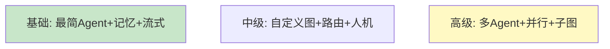
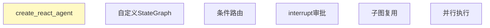

# 代码示例集图解

> 用图解理解从基础到高级的代码模式。

---

## 一、三个层级

```mermaid
graph TB
    BASIC["基础: 最简Agent+记忆+流式"]
    INTER["中级: 自定义图+路由+人机"]
    ADV["高级: 多Agent+并行+子图"]

    style BASIC fill:#C8E6C9
    style ADV fill:#FFF9C4
```

---

## 二、模式速查

```mermaid
graph TB
    P1["create_react_agent"]
    P2["自定义StateGraph"]
    P3["条件路由"]
    P4["interrupt审批"]
    P5["子图复用"]
    P6["并行执行"]

    style P1 fill:#FFF9C4
```

---

## 三、检查清单

| 检查项 | 状态 |
|--------|------|
| 有基础示例 | ☐ |
| 有高级示例 | ☐ |
