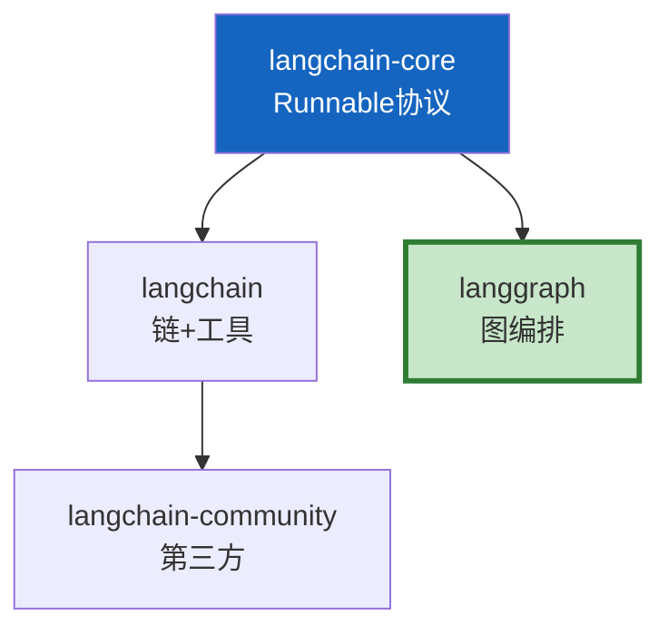
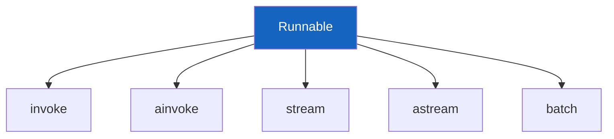

# LangChain 架构图解

> 用图解理解 v0.3 架构、Runnable 协议和 LCEL。

---

## 一、v0.3 架构

```mermaid
graph TB
    CORE["langchain-core<br/>Runnable协议"]
    MAIN["langchain<br/>链+工具"]
    GRAPH["langgraph<br/>图编排"]
    COMM["langchain-community<br/>第三方"]

    CORE --> MAIN & GRAPH
    MAIN --> COMM

    style CORE fill:#1565C0,color:#fff
    style GRAPH fill:#C8E6C9,stroke:#2E7D32,stroke-width:3px
```

---

## 二、Runnable 接口

```mermaid
graph TB
    R["Runnable"] --> I["invoke"]
    R --> AI["ainvoke"]
    R --> S["stream"]
    R --> AS["astream"]
    R --> B["batch"]

    style R fill:#1565C0,color:#fff
```

---

## 三、检查清单

| 检查项 | 状态 |
|--------|------|
| 理解v0.3架构 | ☐ |
| 知道Runnable | ☐ |
