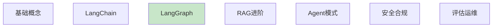

# 技术术语图解

> 用图解理解术语分类体系。

---

## 一、7大分类

```mermaid
graph TB
    C1["基础概念"]
    C2["LangChain"]
    C3["LangGraph"]
    C4["RAG进阶"]
    C5["Agent模式"]
    C6["安全合规"]
    C7["评估运维"]

    style C3 fill:#C8E6C9
```

---

## 二、检查清单

| 检查项 | 状态 |
|--------|------|
| 覆盖7大分类 | ☐ |
| 可搜索 | ☐ |
