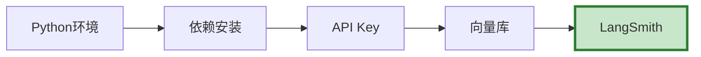

# 环境配置图解

> 用图解理解配置 5 步。

---

## 一、5步配置

```mermaid
graph LR
    S1["Python环境"] --> S2["依赖安装"]
    S2 --> S3["API Key"]
    S3 --> S4["向量库"]
    S4 --> S5["LangSmith"]

    style S5 fill:#C8E6C9,stroke:#2E7D32,stroke-width:3px
```

---

## 二、检查清单

| 检查项 | 状态 |
|--------|------|
| Python就绪 | ☐ |
| 依赖已装 | ☐ |
| API Key配 | ☐ |
