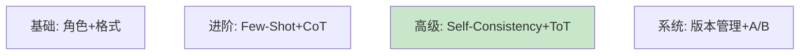
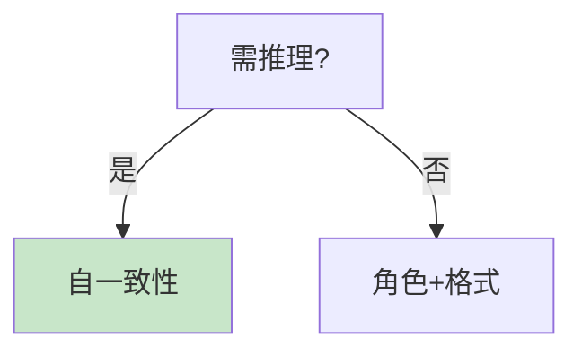

# 高级 Prompt 图解

> 用图解理解 10 个技巧和选型决策。

---

## 一、四层技巧

```mermaid
graph TB
    L1["基础: 角色+格式"]
    L2["进阶: Few-Shot+CoT"]
    L3["高级: Self-Consistency+ToT"]
    L4["系统: 版本管理+A/B"]

    style L3 fill:#C8E6C9
```

---

## 二、选型

```mermaid
graph TB
    Q["需推理?"] -->|是| SC["自一致性"]
    Q -->|否| BASIC["角色+格式"]

    style SC fill:#C8E6C9
```

---

## 三、检查清单

| 检查项 | 状态 |
|--------|------|
| 知道10个技巧 | ☐ |
| 能选技巧 | ☐ |
