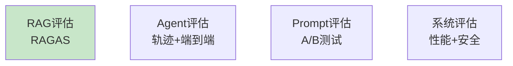

# 评估测试图解

> 用图解理解评估体系和方法选择。

---

## 一、评估全景

```mermaid
graph TB
    R1["RAG评估<br/>RAGAS"]
    R2["Agent评估<br/>轨迹+端到端"]
    R3["Prompt评估<br/>A/B测试"]
    R4["系统评估<br/>性能+安全"]

    style R1 fill:#C8E6C9
```

---

## 二、检查清单

| 检查项 | 状态 |
|--------|------|
| 有方法速查 | ☐ |
| 有推荐决策 | ☐ |
