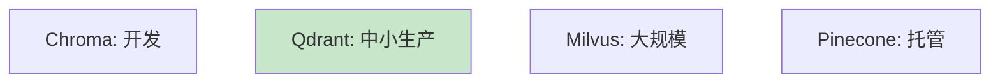
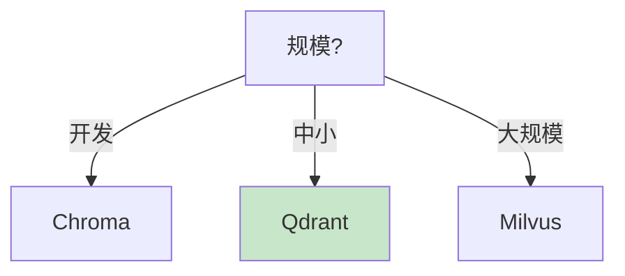

# 向量数据库图解

> 用图解理解 6 大向量库对比和选型。

---

## 一、6大对比

```mermaid
graph TB
    CHROMA["Chroma: 开发"]
    QDRANT["Qdrant: 中小生产"]
    MILVUS["Milvus: 大规模"]
    PINE["Pinecone: 托管"]

    style QDRANT fill:#C8E6C9
```

---

## 二、选型

```mermaid
graph TB
    Q1["规模?"] -->|开发| CHROMA["Chroma"]
    Q1 -->|中小| QDRANT["Qdrant"]
    Q1 -->|大规模| MILVUS["Milvus"]

    style QDRANT fill:#C8E6C9
```

---

## 三、检查清单

| 检查项 | 状态 |
|--------|------|
| 有6大对比 | ☐ |
| 有选型 | ☐ |
