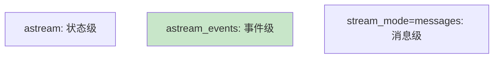
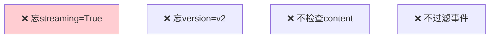

# 流式输出图解

> 用图解理解三种流式模式和常见陷阱。

---

## 一、三种模式

```mermaid
graph TB
    M1["astream: 状态级"]
    M2["astream_events: 事件级"]
    M3["stream_mode=messages: 消息级"]

    style M2 fill:#C8E6C9
```

---

## 二、陷阱

```mermaid
graph TB
    P1["❌ 忘streaming=True"]
    P2["❌ 忘version=v2"]
    P3["❌ 不检查content"]
    P4["❌ 不过滤事件"]

    style P1 fill:#FFCDD2
```

---

## 三、检查清单

| 检查项 | 状态 |
|--------|------|
| 知道三种模式 | ☐ |
| 避免陷阱 | ☐ |
