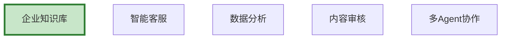
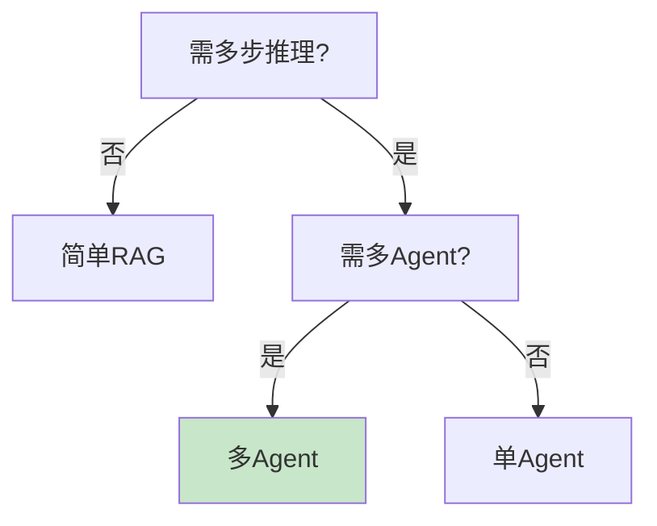

# 架构案例图解

> 用图解理解 5 个架构案例和选型决策。

---

## 一、5个案例

```mermaid
graph TB
    C1["企业知识库"]
    C2["智能客服"]
    C3["数据分析"]
    C4["内容审核"]
    C5["多Agent协作"]

    style C1 fill:#C8E6C9,stroke:#2E7D32,stroke-width:3px
```

---

## 二、选型

```mermaid
graph TB
    Q["需多步推理?"] -->|否| SIMPLE["简单RAG"]
    Q -->|是| Q2["需多Agent?"]
    Q2 -->|是| MULTI["多Agent"]
    Q2 -->|否| AGENT["单Agent"]

    style MULTI fill:#C8E6C9
```

---

## 三、检查清单

| 检查项 | 状态 |
|--------|------|
| 有5个案例 | ☐ |
| 有选型 | ☐ |
