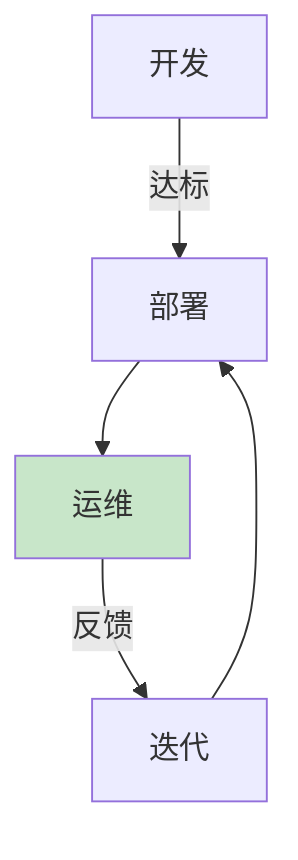

# 全生命周期图解

> 用图解理解五阶段和流转。

---

## 一、五阶段

```mermaid
graph LR
    S1["构想"] --> S2["开发"]
    S2 --> S3["部署"]
    S3 --> S4["运维"]
    S4 --> S5["迭代/退役"]

    style S4 fill:#C8E6C9
```

---

## 二、流转

```mermaid
graph TB
    DEV["开发"] -->|"达标"| DEPLOY["部署"]
    DEPLOY --> OPS["运维"]
    OPS -->|"反馈"| ITERATE["迭代"]
    ITERATE --> DEPLOY

    style OPS fill:#C8E6C9
```

---

## 三、检查清单

| 检查项 | 状态 |
|--------|------|
| 知道五阶段 | ☐ |
