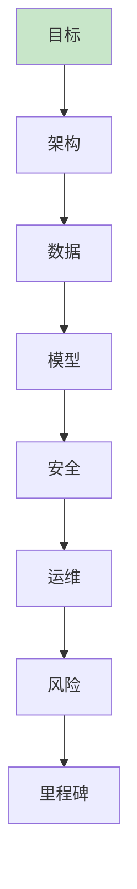

# 设计文档图解

> 用图解理解精简模板和评审检查。

---

## 一、文档结构

```mermaid
graph TB
    T1["目标"] --> T2["架构"]
    T2 --> T3["数据"]
    T3 --> T4["模型"]
    T4 --> T5["安全"]
    T5 --> T6["运维"]
    T6 --> T7["风险"]
    T7 --> T8["里程碑"]

    style T1 fill:#C8E6C9
```

---

## 二、检查清单

| 检查项 | 状态 |
|--------|------|
| 有精简模板 | ☐ |
| 有评审检查 | ☐ |
