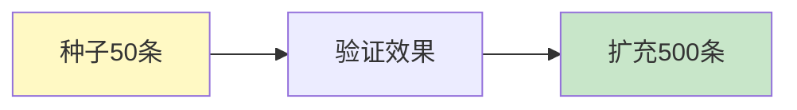
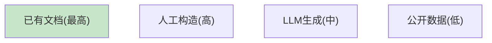

# 冷启动图解

> 用图解理解三阶段和种子数据来源。

---

## 一、三阶段

```mermaid
graph LR
    S1["种子50条"] --> S2["验证效果"] --> S3["扩充500条"]

    style S1 fill:#FFF9C4
    style S3 fill:#C8E6C9
```

---

## 二、数据来源

```mermaid
graph TB
    D1["已有文档(最高)"]
    D2["人工构造(高)"]
    D3["LLM生成(中)"]
    D4["公开数据(低)"]

    style D1 fill:#C8E6C9
```

---

## 三、检查清单

| 检查项 | 状态 |
|--------|------|
| 有种子来源 | ☐ |
| 有效果验证 | ☐ |
