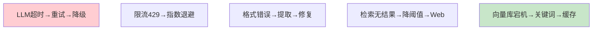

# 错误处理图解

> 用图解理解错误分类和处理策略。

---

## 一、错误分类

```mermaid
graph TB
    E1["LLM超时→重试→降级"]
    E2["限流429→指数退避"]
    E3["格式错误→提取→修复"]
    E4["检索无结果→降阈值→Web"]
    E5["向量库宕机→关键词→缓存"]

    style E1 fill:#FFCDD2
    style E5 fill:#C8E6C9
```

---

## 二、检查清单

| 检查项 | 状态 |
|--------|------|
| 有错误速查 | ☐ |
| 有重试策略 | ☐ |
