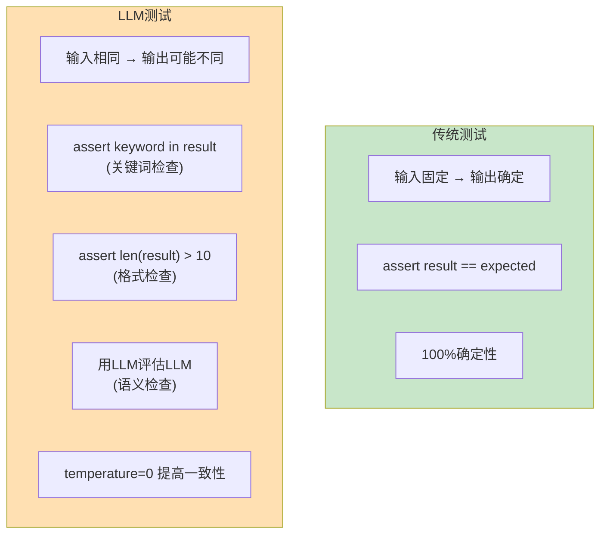
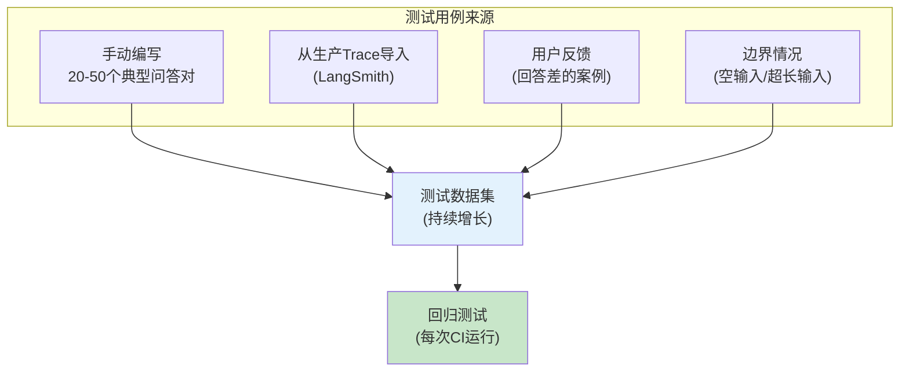

# CI/CD 流水线图解

> 用图解理解 LLM 应用的 CI/CD 流水线、测试分层和质量门禁。

---

## 一、CI/CD 全景

```mermaid
graph LR
    subgraph 开发流程 ["LLM应用CI/CD流水线"}
        DEV["本地开发"] --> COMMIT["git commit"]
        COMMIT --> PUSH["git push"]
        PUSH --> CI["CI自动触发"]
        CI --> TEST["分层测试"]
        TEST --> GATE{"质量门禁"}
        GATE -->|"通过"| DEPLOY["部署"]
        GATE -->|"失败"| NOTIFY["通知开发者"]
        NOTIFY --> DEV
    end

    style CI fill:#E3F2FD
    style TEST fill:#FFF9C4
    style GATE fill:#FFE0B2
    style DEPLOY fill:#C8E6C9
    style NOTIFY fill:#FFCDD2
```

## 二、测试金字塔

```mermaid
graph TB
    subgraph 测试金字塔 ["LLM应用测试金字塔"}
        TOP["顶层: 人工评估<br/>抽样检查最终输出<br/>频率: 发布前<br/>成本: 高<br/>数量: 少量"]
        MID["中层: LLM评估测试<br/>用LLM评价LLM输出<br/>频率: 每次PR<br/>成本: 中<br/>数量: 20-50"]
        BOT["底层: 单元测试<br/>测试非LLM逻辑<br/>频率: 每次提交<br/>成本: 0<br/>数量: 大量"]
    end

    BOT --> MID --> TOP

    style BOT fill:#C8E6C9,stroke:#2E7D32,stroke-width:3px
    style MID fill:#FFF9C4,stroke:#F9A825,stroke-width:2px
    style TOP fill:#FFE0B2,stroke:#E65100,stroke-width:2px
```

## 三、CI 流水线详解

```mermaid
graph TB
    subgraph CI流水线 ["GitHub Actions CI流水线"}
        S1["Step 1: Checkout<br/>拉取代码"]
        S1 --> S2["Step 2: Setup Python<br/>安装Python 3.11"]
        S2 --> S3["Step 3: Install deps<br/>pip install -r requirements.txt"]
        S3 --> S4["Step 4: 单元测试<br/>pytest -m unit<br/>不消耗Token<br/>秒级完成"]
        S4 --> S5{"单元测试通过?"}
        S5 -->|"否"| FAIL["❌ 阻止合并"]
        S5 -->|"是"| S6["Step 5: 覆盖率检查<br/>(非LLM部分 ≥80%)"]
        S6 --> S7{"覆盖率达标?"}
        S7 -->|"否"| FAIL
        S7 -->|"是"| S8["Step 6: LLM测试<br/>pytest -m llm<br/>消耗Token<br/>需要API Key"]
        S8 --> S9{"LLM测试通过?"}
        S9 -->|"否"| WARN["⚠️ 标记警告"]
        S9 -->|"是"| S10["Step 7: 生成报告"]
        S10 --> PASS["✅ 允许合并"]
    end

    style S4 fill:#C8E6C9
    style S8 fill:#FFF9C4
    style FAIL fill:#FFCDD2
    style PASS fill:#C8E6C9
    style WARN fill:#FFE0B2
```

## 四、触发策略

```mermaid
graph TB
    subgraph 触发策略 ["CI触发策略"}
        T1["push到main<br/>→ 只跑单元测试<br/>→ 快速验证<br/>→ 不消耗Token"]
        T2["Pull Request<br/>→ 单元 + LLM测试<br/>→ 完整验证<br/>→ 消耗Token"]
        T3["手动触发<br/>→ 跑指定测试<br/>→ 调试用"]
        T4["定时触发(cron)<br/>→ 每日回归测试<br/>→ 监控模型变化"]
    end

    style T1 fill:#C8E6C9
    style T2 fill:#FFF9C4
    style T3 fill:#E3F2FD
    style T4 fill:#F3E5F5
```

## 五、质量门禁规则

```mermaid
graph TB
    subgraph 质量门禁 ["质量门禁规则"}
        G1["① 单元测试: 100%通过<br/>否则阻止合并"]
        G2["② 代码覆盖率: ≥80%<br/>(非LLM部分)"]
        G3["③ LLM测试: 关键词检查通过<br/>(允许语义变化)"]
        G4["④ LLM测试: 回归检查通过<br/>(已知问题不重现)"]
        G5["⑤ 代码质量: 无明显坏味道<br/>(可选)"]
    end

    G1 & G2 --> HARD["硬门禁<br/>(必须通过)"]
    G3 & G4 --> SOFT["软门禁<br/>(警告但可合并)"]
    G5 --> INFO["信息门禁<br/>(建议)"]

    style HARD fill:#FFCDD2,stroke:#C62828,stroke-width:3px
    style SOFT fill:#FFF9C4,stroke:#F9A825,stroke-width:2px
    style INFO fill:#E3F2FD,stroke:#1565C0
```

## 六、本地开发循环

```mermaid
graph TB
    subgraph 本地开发循环 ["本地开发循环"}
        DEV["修改代码/Prompt"] --> UNIT["pytest -m unit<br/>(秒级，不消耗Token)"]
        UNIT -->|"通过"| LLM["pytest -m llm<br/>(分钟级，消耗Token)"]
        UNIT -->|"失败"| DEV
        LLM -->|"通过"| COMMIT["git commit + push"]
        LLM -->|"失败"| DEV
        COMMIT --> CI["CI自动运行"]
        CI -->|"通过"| PR["创建/更新PR"]
        CI -->|"失败"| DEV
    end

    style UNIT fill:#C8E6C9
    style LLM fill:#FFF9C4
    style PR fill:#F3E5F5
    style DEV fill:#E3F2FD
```

## 七、LLM 测试与传统测试的对比



## 八、测试用例管理


