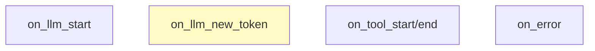

# 回调系统图解

> 用图解理解回调事件和三种处理器。

---

## 一、事件类型

```mermaid
graph TB
    E1["on_llm_start"]
    E2["on_llm_new_token"]
    E3["on_tool_start/end"]
    E4["on_error"]

    style E2 fill:#FFF9C4
```

---

## 二、三种处理器

```mermaid
graph TB
    LOG["日志: 记录事件"]
    METRICS["指标: 采集性能"]
    TRACE["追踪: 执行轨迹"]

    style TRACE fill:#C8E6C9
```

---

## 三、检查清单

| 检查项 | 状态 |
|--------|------|
| 有事件速查 | ☐ |
| 有三种处理器 | ☐ |
