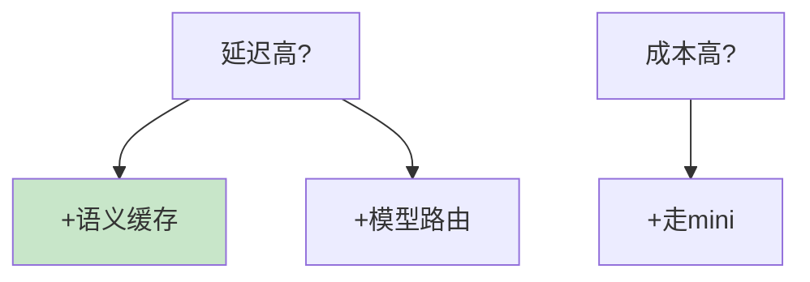

# 性能基准图解

> 用图解理解性能指标和调优建议。

---

## 一、指标速查

```mermaid
graph TB
    M1["TTFT <500ms"]
    M2["TPS >50"]
    M3["P95 <3s"]
    M4["成本 <$0.01/req"]

    style M1 fill:#FFF9C4
```

---

## 二、调优

```mermaid
graph TB
    SLOW["延迟高?"] --> CACHE["+语义缓存"]
    SLOW --> ROUTE["+模型路由"]
    COST["成本高?"] --> MINI["+走mini"]

    style CACHE fill:#C8E6C9
```

---

## 三、检查清单

| 检查项 | 状态 |
|--------|------|
| 有指标速查 | ☐ |
| 有调优建议 | ☐ |
