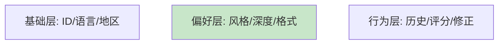
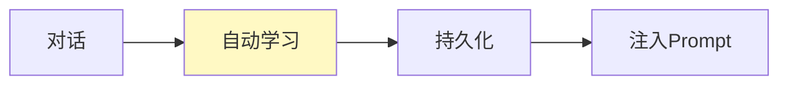

# 用户画像图解

> 用图解理解画像三层和学习流程。

---

## 一、画像三层

```mermaid
graph TB
    L1["基础层: ID/语言/地区"]
    L2["偏好层: 风格/深度/格式"]
    L3["行为层: 历史/评分/修正"]

    style L2 fill:#C8E6C9
```

---

## 二、学习流程

```mermaid
graph LR
    DIALOG["对话"] --> LEARN["自动学习"] --> STORE["持久化"] --> INJECT["注入Prompt"]

    style LEARN fill:#FFF9C4
```

---

## 三、检查清单

| 检查项 | 状态 |
|--------|------|
| 有画像结构 | ☐ |
| 有学习引擎 | ☐ |
