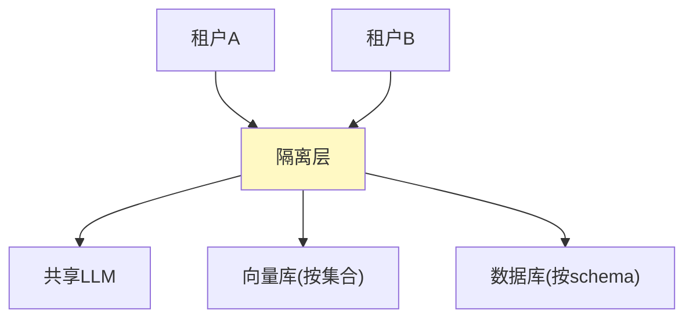

# 多租户架构图解

> 用图解理解隔离方案和配额管理。

---

## 一、隔离架构

```mermaid
graph TB
    A["租户A"] --> ISO["隔离层"]
    B["租户B"] --> ISO
    ISO --> LLM["共享LLM"]
    ISO --> VEC["向量库(按集合)"]
    ISO --> DB["数据库(按schema)"]

    style ISO fill:#FFF9C4
```

---

## 二、检查清单

| 检查项 | 状态 |
|--------|------|
| 有租户管理 | ☐ |
| 有隔离方案 | ☐ |
