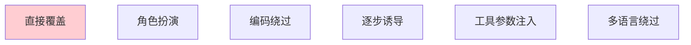
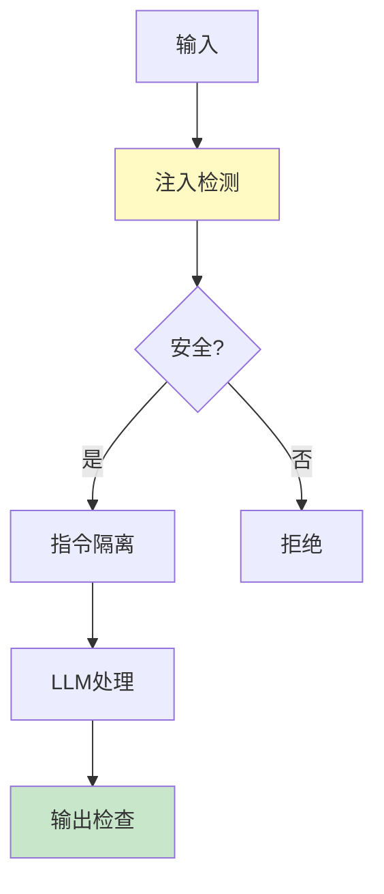

# Prompt 注入攻防图解

> 用图解理解 6 种注入类型和防御。

---

## 一、6种注入

```mermaid
graph TB
    T1["直接覆盖"]
    T2["角色扮演"]
    T3["编码绕过"]
    T4["逐步诱导"]
    T5["工具参数注入"]
    T6["多语言绕过"]

    style T1 fill:#FFCDD2
```

---

## 二、防御

```mermaid
graph TB
    INPUT["输入"] --> DETECT["注入检测"]
    DETECT --> SAFE{"安全?"}
    SAFE -->|是| ISOLATE["指令隔离"]
    SAFE -->|否| REJECT["拒绝"]
    ISOLATE --> LLM["LLM处理"]
    LLM --> CHECK["输出检查"]

    style DETECT fill:#FFF9C4
    style CHECK fill:#C8E6C9
```

---

## 三、检查清单

| 检查项 | 状态 |
|--------|------|
| 有注入检测 | ☐ |
| 有防御方案 | ☐ |
