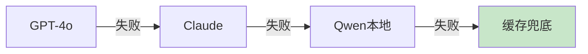

# 容灾高可用图解

> 用图解理解容灾三层和降级链。

---

## 一、容灾三层

```mermaid
graph TB
    L1["接入层: DNS+LB"]
    L2["服务层: 多实例+健康检查"]
    L3["数据层: 主备+备份"]

    style L3 fill:#C8E6C9
```

---

## 二、降级链

```mermaid
graph LR
    M1["GPT-4o"] -->|失败| M2["Claude"]
    M2 -->|失败| M3["Qwen本地"]
    M3 -->|失败| M4["缓存兜底"]

    style M4 fill:#C8E6C9
```

---

## 三、检查清单

| 检查项 | 状态 |
|--------|------|
| 有容灾架构 | ☐ |
| 有降级链 | ☐ |
