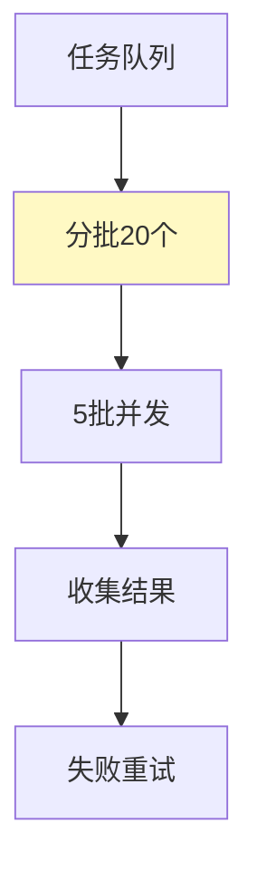
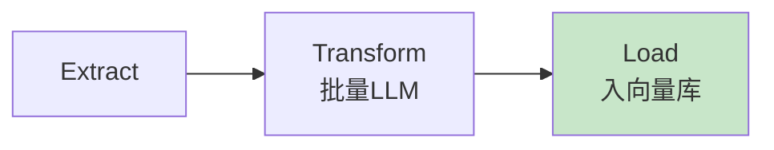

# 批量处理 ETL 图解

> 用图解理解批量流程和 ETL 管线。

---

## 一、批量流程

```mermaid
graph TB
    QUEUE["任务队列"] --> BATCH["分批20个"]
    BATCH --> CONCURRENT["5批并发"]
    CONCURRENT --> COLLECT["收集结果"]
    COLLECT --> RETRY["失败重试"]

    style BATCH fill:#FFF9C4
```

---

## 二、ETL

```mermaid
graph LR
    E["Extract"] --> T["Transform<br/>批量LLM"]
    T --> L["Load<br/>入向量库"]

    style L fill:#C8E6C9
```

---

## 三、检查清单

| 检查项 | 状态 |
|--------|------|
| 有批量处理器 | ☐ |
| 有ETL管线 | ☐ |
