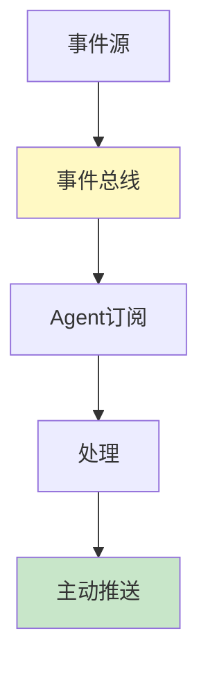

# 事件驱动架构图解

> 用图解理解事件总线和发布订阅。

---

## 一、事件架构

```mermaid
graph TB
    SRC["事件源"] --> BUS["事件总线"]
    BUS --> SUB["Agent订阅"]
    SUB --> ACT["处理"]
    ACT --> PUSH["主动推送"]

    style BUS fill:#FFF9C4
    style PUSH fill:#C8E6C9
```

---

## 二、检查清单

| 检查项 | 状态 |
|--------|------|
| 有事件总线 | ☐ |
| 有主动推送 | ☐ |
