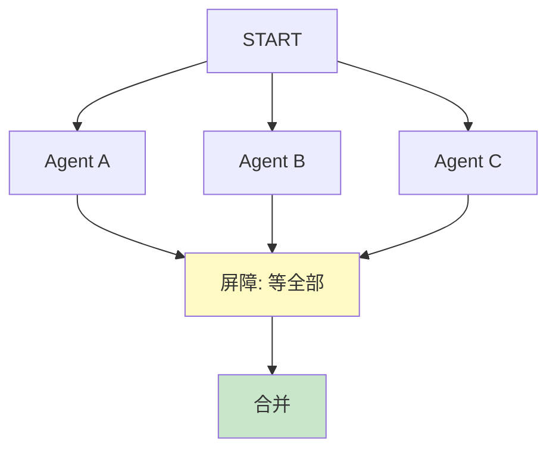

# 并行扇出图解

> 用图解理解并行执行和屏障等待。

---

## 一、并行架构

```mermaid
graph TB
    START --> A["Agent A"]
    START --> B["Agent B"]
    START --> C["Agent C"]
    A & B & C --> BARRIER["屏障: 等全部"]
    BARRIER --> MERGE["合并"]

    style BARRIER fill:#FFF9C4
    style MERGE fill:#C8E6C9
```

---

## 二、检查清单

| 检查项 | 状态 |
|--------|------|
| 有并行图 | ☐ |
| 有屏障 | ☐ |
