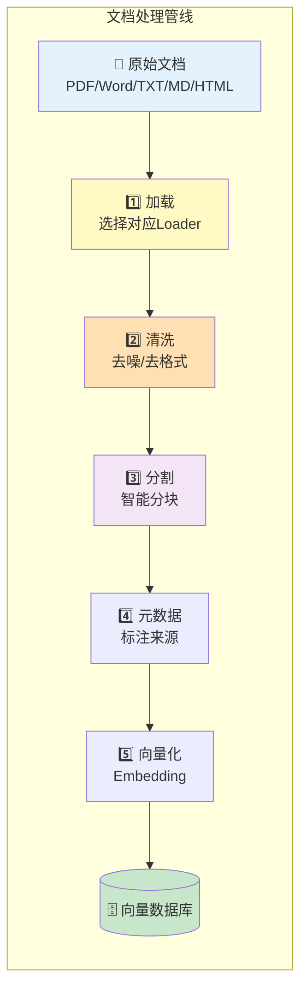
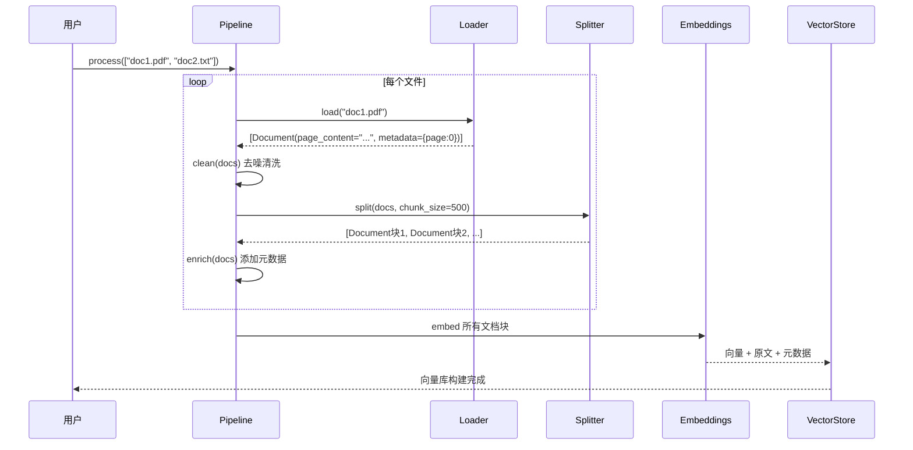

# 文档处理管线图解

> 用图解理解从原始文档到向量库的完整处理流程。

---

## 一、完整管线



## 二、各格式加载策略

```mermaid
graph TB
    subgraph 格式路由 {"根据文件类型选择Loader"}
        PDF["📄 PDF<br/>→ PyPDFLoader<br/>→ PyMuPDFLoader(复杂排版)"]
        DOCX["📝 Word<br/>→ Docx2txtLoader"]
        TXT["📄 TXT<br/>→ TextLoader"]
        MD["📋 Markdown<br/>→ UnstructuredMarkdownLoader"]
        HTML["🌐 HTML<br/>→ WebBaseLoader"]
        IMG["🖼️ 扫描件/图片<br/>→ UnstructuredImageLoader<br/>→ 或多模态LLM OCR"]
        CSV["📊 CSV/Excel<br/>→ CSVLoader"]
    end

    style PDF fill:#E3F2FD
    style IMG fill:#FFE0B2
    style CSV fill:#C8E6C9
```

## 三、清洗流程

```mermaid
graph TB
    subgraph 清洗步骤 {"文档清洗步骤"}
        S1["输入: 原始文本<br/>(含噪声)"]
        S1 --> S2["去除多余空白<br/>\n{3,} → \n\n"]
        S2 --> S3["去除控制字符<br/>\\x00-\\x1f"]
        S3 --> S4["去除页眉页脚<br/>'第X页'/'Page N'"]
        S4 --> S5["去除水印标记<br/>'confidential'"]
        S5 --> S6["输出: 干净文本"]
    end

    style S1 fill:#FFCDD2
    style S6 fill:#C8E6C9
```

## 四、分割策略对比

```mermaid
graph TB
    subgraph 分割策略 {"三种分割策略"}
        R["递归分割<br/>RecursiveCharacterTextSplitter<br/>通用方案<br/>按分隔符层级分割"] --> R_R["适用于: 纯文本/通用"]

        M["按标题分割<br/>MarkdownHeaderTextSplitter<br/>保留文档结构<br/>每块带标题元数据"] --> M_R["适用于: Markdown"]

        C["按语言分割<br/>from_language(PYTHON)<br/>保留代码块完整<br/>不在函数中间断开"] --> C_R["适用于: 代码文档"]
    end

    style R fill:#C8E6C9
    style M fill:#E3F2FD
    style C fill:#FFF9C4
```

## 五、表格特殊处理

```mermaid
graph TB
    subgraph 表格处理 {"PDF表格处理流程"}
        P["📄 PDF文档<br/>含有表格"]
        P --> EX["用pdfplumber提取表格"]
        EX --> T1["表格1<br/>| 产品 | 价格 | 库存 |<br/>| 耳机 | 299 | 50 |"]
        EX --> T2["表格2..."]
        P --> TX["用PyPDF提取纯文本"]
        T1 & T2 & TX --> MERGE["合并为Document列表"]
        MERGE --> V[("向量数据库")]
    end

    style T1 fill:#FFF9C4
    style TX fill:#E3F2FD
    style V fill:#C8E6C9
```

## 六、元数据层级

```mermaid
graph TB
    subgraph 元数据 {"文档块的元数据"}
        D["📄 文档块<br/>'蓝牙耳机支持蓝牙5.3...'"]
        D --> M1["source: product_manual.pdf<br/>来源文件名"]
        D --> M2["page: 3<br/>页码"]
        D --> M3["chapter: 规格参数<br/>章节"]
        D --> M4["file_type: .pdf<br/>文件类型"]
        D --> M5["chunk_length: 487<br/>块长度"]
    end

    style D fill:#E3F2FD
    style 元数据 fill:#FFF9C4
```

## 七、完整管线数据流


