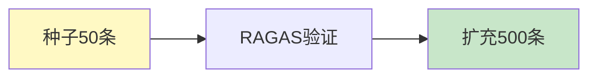

# 冷启动图解

> 用图解理解三阶段和验证标准。

---

## 一、三阶段

```mermaid
graph LR
    S1["种子50条"] --> S2["RAGAS验证"] --> S3["扩充500条"]

    style S1 fill:#FFF9C4
    style S3 fill:#C8E6C9
```

---

## 二、检查清单

| 检查项 | 状态 |
|--------|------|
| 有种子来源 | ☐ |
| 有验证器 | ☐ |
